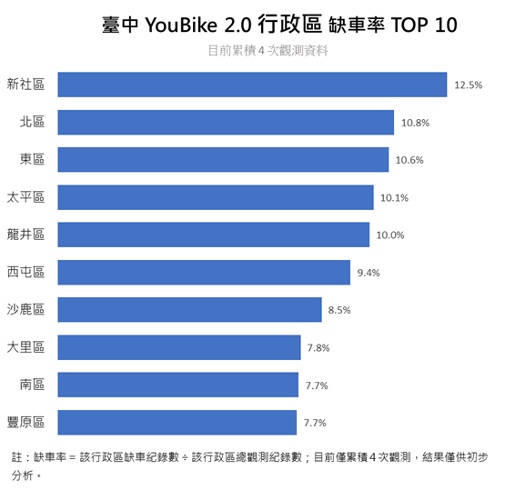

# 🚲 臺中 YouBike 2.0 即時供需分析

使用 Python 串接臺中市 YouBike 2.0 即時公開資料 API，整理場站資訊並持續累積歷史資料，作為後續供需分析與資料視覺化使用。


## 📌 專案功能

* 取得臺中市 YouBike 2.0 即時資料
* JSON 轉換為 Pandas DataFrame
* 將 API 英文欄位轉為中文
* 整理日期、車輛數與場站資料
* 將每次抓取結果追加至 `ubike_history.csv`
* 記錄每次資料抓取時間
* 保留歷史資料供後續分析使用

## 📊 初步分析結果

### 臺中 YouBike 2.0 行政區缺車率 TOP 10



目前累積 **4 次 YouBike 即時資料觀測**。

初步結果顯示，**新社區缺車率最高，為 12.5%**，其次為 **北區 10.8%**、**東區 10.6%**，太平區與龍井區也皆達到 10% 以上。

缺車率計算方式：

> 缺車率 = 該行政區缺車紀錄數 ÷ 該行政區總觀測紀錄數

> ⚠️ 目前僅累積 4 次觀測資料，樣本數仍少，因此結果僅供初步分析。後續將持續累積資料，以觀察較穩定的供需趨勢。

## 🔄 資料流程

```text
YouBike API
    ↓
requests 取得 JSON
    ↓
Pandas DataFrame
    ↓
資料整理 / 欄位中文化
    ↓
加入抓取時間
    ↓
ubike_history.csv
    ↓
Excel / Python 資料分析
    ↓
資料視覺化
```

## 📂 專案結構

```text
taichung-youbike-analysis/
│
├── data/
│   └── ubike_history.csv
│
├── docs/
│   └── images/
│       └── district-shortage-rate-top10.png
│
├── ubike_parser.py
├── README.md
├── pyproject.toml
└── uv.lock
```

## 📋 主要資料欄位

| 欄位      | 說明               |
| ------- | ---------------- |
| 場站名稱    | YouBike 場站名稱     |
| 行政區     | 場站所在行政區          |
| 總停車格數   | 場站總容量            |
| 可借車輛數   | 目前可借車輛           |
| 可還空位數   | 目前可還車位           |
| 資料更新時間  | API 資料更新時間       |
| 抓取時間    | Python 實際取得資料的時間 |
| 緯度 / 經度 | 後續地圖分析使用         |

## 🛠️ 使用技術

`Python` `Requests` `Pandas` `CSV` `Excel` `Git` `GitHub`

## 🚧 專案進度

* [x] 即時資料取得
* [x] CSV 歷史資料累積
* [x] 更新時間紀錄
* [x] 行政區缺車率初步分析
* [x] Excel 資料視覺化
* [ ] 場站缺車 / 滿站分析
* [ ] 尖峰時段分析
* [ ] 平日 / 假日比較
* [ ] Matplotlib 視覺化
* [ ] Power BI Dashboard

## 💡 專案目標

透過累積不同時間點的 YouBike 資料，分析哪些場站容易缺車或沒有空位，以及不同時段與行政區的供需變化。
